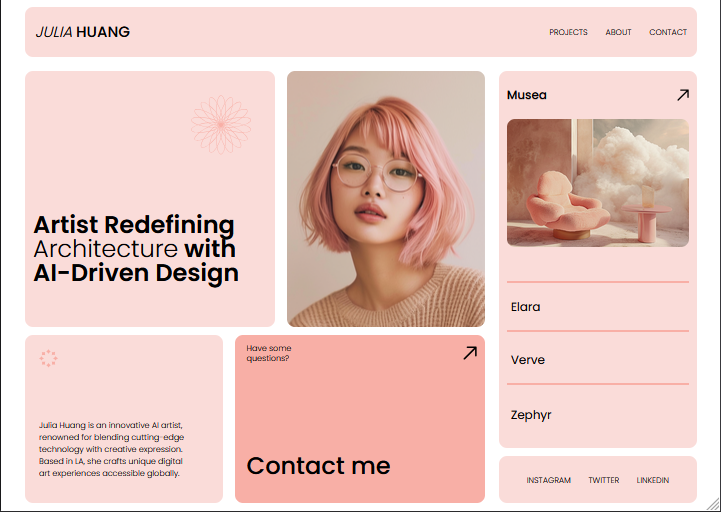
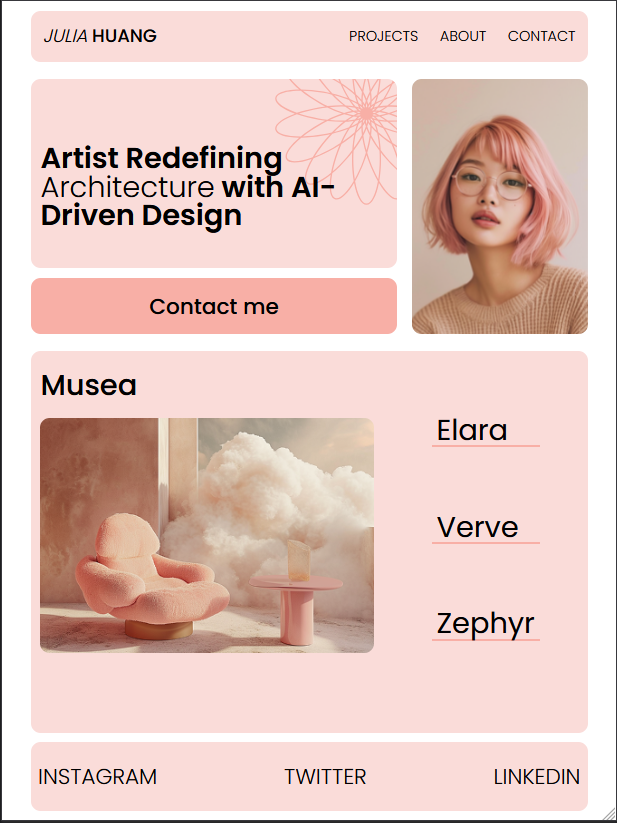
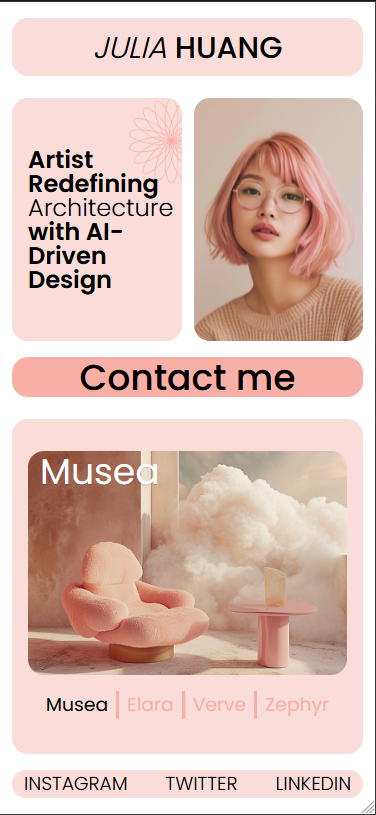

# 06-SAS_Portfolio

Situação de Atividade Somativa para aplicação do conteúdo estudado no primeiro Semestre em HTML, CSS e Tailwind CSS.
Tendo como proposta criar variações no Figma para tablet e celular, partindo de um layout inicial desenvolvido para desktop. Fazendo em seguida a construção dessa pagina em HTML, itlizando o Tailwind CSS para realizar a formatação e responsividade da página

### Figma
https://www.figma.com/design/tbGC8kbPixmJ2K54Ea5xhy/lima---portfolio---vEdvan?node-id=0-1&t=9VTGkAqvVhdPCJGW-1

## Layouts

### Layout Desktop (1440px+)

### Layout Tablet (768px+)

### Layout Celular

## Tecnologias utilizadas:

* Figma
* HTML
* Tailwind CSS

## Autor
[Edvan Alves](<https://br.linkedin.com/in/edvan-alves>)
